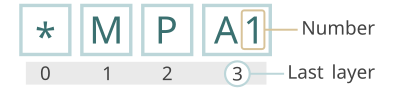
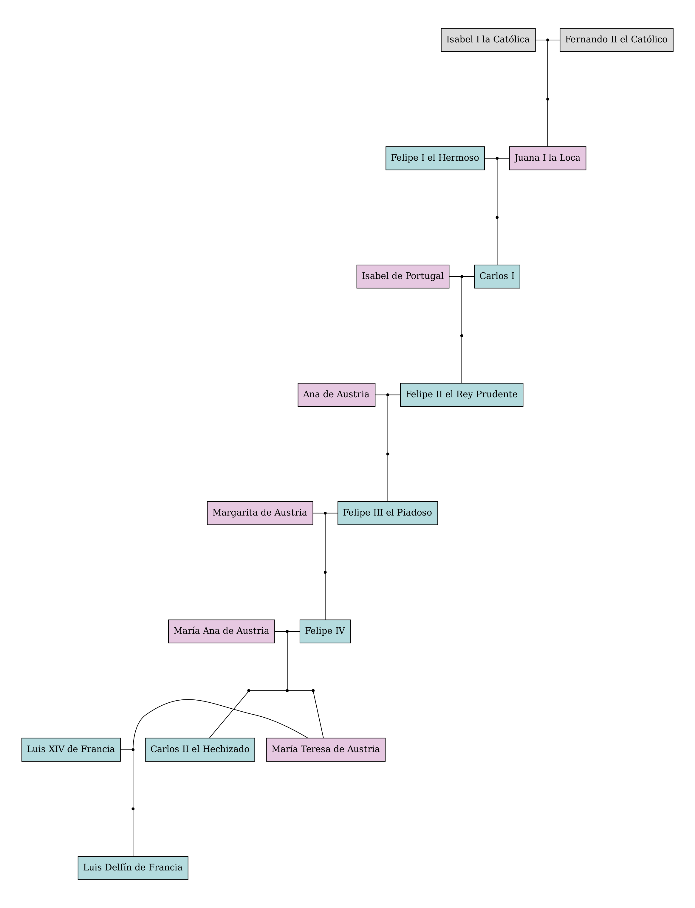

# Encoding kinship relations: The Fcode
The method outlined below allows for the straightforward encoding of any type of kinship relationship. I have designated the resulting code as the "**Fcode**".

Utilizing Fcodes for encoding kinship relationships offers several advantages:

1. **Efficiency**: The encoding algorithm is straightforward, easy to grasp, and quick to implement. Additionally, the generated codes are easily comprehensible to humans, maintaining the utility of the encoded data.

2. **Adaptability**: Kinship relationships are deduced from a set of codes, eliminating the necessity for adhering to a rigid structure. Fcodes operate independently, allowing them to be inserted out of sequence without disrupting the fundamental relationships. This affords a high degree of flexibility in data collection.

3. **Accessibility**: Fcode encoding can be carried out with minimal tools, such as a pen and paper. In digital environments, these codes can be stored in any text file, thereby freeing the codification process from dependence on a specific operating system.

> [!TIP]
> For kinship encoding with the Fcode algorithm, consider using the [**F-Tree**](https://github.com/Dannyzimmer/F-Tree) graphical interface. It provides a user-friendly way to apply the algorithm.

## Table of contents
- [The Encoding Algorithm](#the-encoding-algorithm)
    - [Encoding legend](#encoding-legend)
    - [Encoding rules](#encoding-rules)
    - [Preparing the data file](#preparing-the-data-file)
    - [The Fcode nomenclature](#the-fcode-nomenclature)
- [The Fcode CLI](#the-fcode-cli)
    - [random](#fcode-random)
    - [read](#fcode-read)
    - [record](#fcode-record)
    - [report](#fcode-report)
    - [search](#fcode-search)
    - [tree](#fcode-tree)
- [Classes](#classes)
    - [FcodeManager](#fcodemanager)
    - [FBook](#fbook)
    - [FamilyTree](#familytree)
    - [Fgenerator](#fgenerator)
    - [Freader](#freader)
- [Modules](#modules)
    - [html_report](#html_report)
- [Publications](#publications)

# The Encoding Algorithm
This section explains the process of encoding kinship relationships, establishes a valid data file for working with fcodes, and introduces key terms essential for its comprehension.

## Encoding legend
|   | Fcode legend                     |
|:-:|-------------------------------------|
| * | origin of coordinates (usually oneself) |
| C | spouse                              |
| O | brother                             |
| A | sister                              |
| H | sibling (sex unknown)               |
| P | father                              |
| M | mother                              |
| o | son                                 |
| a | daughter                            |
| h | offspring (sex unknown)             |
---

Along with the encoding legend, it is essential to address the following considerations (especially consideration 1) in order to write a valid fcode:

#### Consideration 1: Numbering of siblings and offspring 
> Siblings (O, A, H) and offspring (o, a, h) must be numerated, starting from the oldest to the youngest (1,2,3…).The numbering does not distinguish between sexes. In case of being unknown use: 
>  - “-” to indicate that it is the youngest.
>  - “:” to indicate that it is not the oldest nor the youngest.
>  - “.” to indicate that its number is unknown.
 
Consideration 1 is essential as it is necessary to distinguish between individuals of the same gender and generation.

#### Consideration 2: Numbering of parents and partners
> Parents (P, M) and partners (C) should also be numerated following the same rules of *consideration 1*, but only when they are the last layer (see section *Layers and depth*). For example: *M2, *MO4, *C3, *CMP1, *CMPO3...

## Encoding rules
An **origin of coordinates (OC)** is taken, **usually oneself**, and from there the kinships are referenced. From the OC to the destination, **each letter that is added refers to the previous letter**. In this way, the kinship can be built from left to right like so:


> [!NOTE]  
> Numbers have been removed from the following example for simplicity.

- **My father = \*P**
    - me --> \*
    - my father --> \*P
- **My paternal aunt = \*PA**
    - me --> \*
    - my father --> \*P
    - the sister of my father --> \*PA
- **My paternal cousin = \*PAa**
    - me --> \*
    - my father --> \*P
    - the sister of my father --> \*PA
    - the daughter of the sister of my father --> \*PAa

And so on:
- **\*MO2CO-a1**: 
    - my mother --> \*M
    - her second brother (my uncle) --> \*MO2
    - the spouse of my uncle (my aunt-in-law) --> \*MO2C
    - the younger brother of my aunt-in-law (my uncle-in-law) --> \*MO2CO-
    - the first daughter of my uncle-in-law --> *MO2CO-a1

## Preparing the data file
To encode an entire family, it is necessary to represent the desired kinship relationships in a tab-separated values (TSV) file —see sections [encoding legend](#encoding-legend) and [encoding rules](#encoding-rules)—. The TSV file should consist of two columns: the first one with the **fcode**, and the second one with the **individual's name**. Empty lines and lines starting with number sign (#) are ommited, thus providing more flexibility to the data collection process.

The aforementioned TSV file will be referred to as the **data file**, or just "the data". An illustrative example of a valid data file is provided below.
```
# Parents
*   Homer Simpson
*C  Marge Simpson

# Offspring
*o1	Bart Simpson
*a2	Lisa Simpson
*a3	Maggie Simpson

# Grandpas
*P  Abe Simpson
*M  Mona Simpson
```

## The Fcode nomenclature
### Layers and depth
Each letter of the Fcode is a **layer**, or in other words, a layer is each of the kindship relationships of a given Fcode. A layer can also have numbers or symbols, those specified on the "encode legend". For example, the code \*MPA1o- can be descomposed in four layers:


The total number of layers of an Fcode is its **depth**.

### Directionality
Fcodes can be read left to right (direction up), or right to left (direction down). Thus, for a given layer, the **upward layer** is the one on its right, whereas the **downward layer** is the one on its left.


### Number
The **number** of a fcode is the **number of its last layer**, that is,  the number of son that is (see [consideration 1](#consideration-1-numbering-of-siblings-and-offspring)).



### Position
When talking about a full Fcode, the term position is used to refer to a specific layer, and all the downward layers until the OC. For example, given the Fcode "\*MO2CO-a1", position 2 is "\*MO2" and position 4 is "\*MO2CO-".


### Booleaning
Booleaning is removing symbols ('-', ':', '.', '') and numbers from a layer, a position, or an fcode, to obtain an **l_bool**, a **p_bool** or a **f_bool** respectively. The length of a f_bool is equal to the depth of its fcode.

| Fcode | F_bool |
| --- | --- |
| *MPO1a1 | *MPOa |
| *MPO2a3 | *MPOa |
| *MPA3a2 | *MPAa |

Three important concepts stem from booleaning: **boolcodes**, **parbools** and **sexed types**. Boolcodes are fcodes with the *upper layer booleanized*, parbools are fcodes with *just the parents (P, M) booleanized*, whereas the sex type is the *upper layer* of a booleanized fcode. For example:

| Fcode | Boolcode | parbool | Sexed type |
| --- | --- | --- | :---: |
| *MP3O1   | *MPO   | *MPO1 | O |
| *MP3O1a1 | *MPO1a | *MPO1a1 | a |
| *MP3A3a2 | *MPA3a | *MPA3a2 | a |
| *MP3A3o3  | *MPA3o | *MPA3o3 | o |

Boolcodes are used to predict parent-offspring relationships; sexed types to predict potential partners, and parbools enable the numeration of parents and partners in a single instance.

### Lineage, type and sexed linages
Lineages are similar to booleaning, but without considering sexes. Therefore, P's, M's, O's and A's are replaced with X's, H's and h's like so:

| Fcode encoding | Lineage encoding |
| --- | :---: |
| P / M | X |
| O / A | H |
| o / a | h |

Lineages can also be applied to a layer (l_lineage), position (p_lineage) or fcode (f_lineage). The lineage of the upper layer is the **type** of the fcode, for example:

| Fcode | f_lineage | type |
|  ---  |    ---   | :---: |
| *MPO1a1 | *XXHh |  h|
| *MPO2a3 | *XXHh |  h|
| *MPA3a2 | *XXHh |  h|
| *MPA3C  | *XXHC |  C|

An special type of linages are **sexed linages**, which are linages with their upper layer booleanized. Sexed linages are very useful for stablish sex-aware kindship relationships (father, grandmother, uncle in law...).

Other type of linages are **linagecodes**, an fcode with a linage in the upper layer. Linagecodes are useful for **searching siblings and offspring** of a given fcode, for example:

|  Fcode  | Lineagecode |
|   ---   |   ---      |
| *MPO1a1 | *MPO1h |
| *MPO2a3 | *MPO2h |
| *MPA3a2 | *MPA3h |
| *MPA3o1 | *MPA3h |

### Fcode patterns
As fcodes should be written using the minimum ammount of symbols possible, there are some combinations of layers that are not recommended. The best strategy to detect such combinations is through lineages. In particular, there are eight patterns that should be steered clear of (refer to the table below).

| Wrong pattern | Right pattern           | Fix                                                                         | Example (wrong) | Example (right) |
|-------|------------------|-------------------------------------------------------------------------------------|-----------------|-----------------|
| CC    | (loop)           | Remove pattern.                                                                     | *CC             | *               |
| hX    | X                | Remove offspring.                                                                   | *a1M3           | *M3             |
| HX    | X                | Remove brother.                                                                     | *O1M3           | *M3             |
| XC    | X (sex switched) | Remove partner, switch parent sex (problem with the layer number).                   | *MC             | *P?             |
| Ch    | h                | Remove partner.                                                                     | *Ca1            | *a1             |
| hH    | h                | Remove offspring, change brother to offspring.                                      | *a1O2           | *o2             |
| HH    | H                | Remove first brother.                                                               | *O2O3           | *O3             |
| Xh    | H                | Remove parent, change offspring to brother. Check if the resulting fcode is the OC. | *Po1            | *O1             |


### Coeficient of consanguinity
It is possible to estimate the coefficient of consanguinity of a given pair of fcodes. To do so, the **common ancestor** must be first identified. The common ancestor between two fcodes is *the last position of aligned code* between them, while the **divergent sections** represent the unmatched layers that remain. The upper layer of each divergent section is the **target layer**.


Finally, when the depth of the two codes varies, the layers present in the longer code without a corresponding counterpart in the shorter one are referred to as orphan layers."


The **coefficient of consanguinity** between two blood lineages is defined as:

$$ F = \left( \frac{1}{2}\right)^{LD + SD} $$

For *LD* being the depth of the longer divergent section and *SD* the depth of the shorter divergent section. However, if a partner layer (C) is present in any of the divergent portions, the coeficient of consanguinity will be 0.

# The Fcode CLI
You can install this package for working with fcodes with pip. After downloading the fcode package, navigate to its root directory (where the setup.py file is placed) an run the following:

```
pip install --editable .
```

After doing this try running `fcode --help` to get a list of all the commands. You can also run `fcode COMMAND --help` to obtain help on a specific command. If you want to uninstall this package, just run:
```
pip uninstall fcode -y
```

## fcode random
Return random fcodes, names and trees.
### Random fcode
Generates a random fcode with a maximum depth of six.
```
$ fcode random --fcode
*PA2o1o1
```
### Random name
Generates random person names.
```
$ fcode random --name
Jordan Thomas
```
### Random data
Generates a random data with a maximum size of 30.
```
$ fcode random --data > random_data.txt
$ head random_data.txt
*P      Ethan Thomas
*M      Leah Watson
*O1     Aiden Bailey
*A2     Bella Harris
*O3     Luca Flores
*       ¿? Patel
*C      ¿? Cox
*MP     Wesley Thomas
*MM     Savannah Ramos
*MO1    Greyson Hernandez
```

## fcode read
Return the reading of the given fcode.
```
$ fcode read *CPMO1
The older brother of the mother of the father of my partner
```

## fcode record
Launches the fcode contructor (NOT YET WORKING).

## fcode report
Prints an HTML report of a data file.
```
$ fcode report random_data.txt > myTree.html
```

## fcode search
Searches names or fcodes in a data file.
### Searching names
```
$ fcode search --name family_data.txt ramon
Ramón Pérez  *PPP       bisabuelo              The father of the father of my father
Ramón Crespo *PPH1      tí@-abuel@             The older sibling of the father of my father
Ramón López  *CMPP      bisabuelo político     The father of the father of the mother of my partner
Ramón Balboa *CMPA3o1   tío segundo político   The older son of the third sister of the father of the mother
```
### Searching an fcode
```
$ fcode search --fcode family_data.txt *PPP
Ramón Pérez
```

## fcode tree
Generates a family tree figure in PDF from a data file.
```
fcode tree --output random_tree random_data.txt
```

# Classes
## FcodeManager
The FcodeManager class manages the use of Fcodes. It has only one argument, an Fcode. The instances of this class have the followin properties:

| Attribute      | Definition                                                          |
|----------------|---------------------------------------------------------------------|
| **code**       | the fcode used as argument to instantiate FcodeManager.             |
| **nlayers**    | the number of layers of the Fcode.                                  |
| **layers**     | a list with the layers of the Fcode as items.                       |
| **sex**        | the sex of the coded relative; male (M), female (F) or unknown (U). |
| **depth**      | the number of layers of the fcode.                                  |
| **type**       | the type of the fcode.                                              |
| **sexed_type** | the sexed type of the fcode.                                        |
| **f_bool**     | the f_bool of the fcode.                                            |
| **boolcode**   | the boolcode of the fcode.                                          |
| **f_linage**   | the sexed type of the fcode.                                        |
| **linagecode** | the lineagecode of the fcode.                                       |
| **number**     | the number of the last layer of the fcode.                          |

An FcodeManager object can also be **sliced**:
```python
fcode = FcodeManager('*MO2CO-a1')
fcode[0]
fcode[-1]
fcode[0:3]
```
```
*
a1
*MO2
```
**iterated**:
 ```python
 [print(layer) for layer in fcode]
 ```

 ```
 *MO2CO-a1
*MO2CO-
*MO2C
*MO2
*M
*
```
and have **\_\_str\_\_** and **\_\_repr\_\_** methods:
```python
str(fcode)
fcode
```
```
*MO2CO-a1

code: *MO2CO-a1
nlayers: 7
layers: ['*', 'M', 'O2', 'C', 'O-', 'a1']
sex: F
```

## FBook
The FBook class manages the kinship relationships between the fcodes of the data file (see section [preparing the data file](#preparing-the-data-file)), allowing to retrieve FcodeManager objects and perform kindship searches (e.g.: search for the offspring of an fcode).


To instantiate the FBook class:
```python
fbook = FBook(path_to_the_data_file)
```

Once instantiated, some useful operations can be performed using the fbook object.

### Searches
An fbook object offers several types of searches:

#### Searching for codes
Query an **fcode/fbool/parbool** and return the **fcode/s** matched in data, if no match, return 'NA':

| Method *(fbook.[\.\.\.])* | Description                                                                     |  
| ---                       |     ---                                                                         | 
| .fcode_search()           | Search an fcode in DATA, if match return the fcode, else return NA.             |
| .fbool_searc()            | First booleanize the fcode, then search it the data booleanized                 |
| .parbool_search()         | First parbooleanized the fcode, then search it the data parbooleanized          |
| .deep_search()            | Perform a fcode_search and parbool_search, returns the first match.             |
| .fcode_multiple_search()  | Return input fcodes present in the registy.                                     |
| .deep_multiple_search()   | Perform a deep_search for each of the fcodes in a list, returns the first match.|

#### Searching for names
Query an **fcode/fbool/parbool** and return the **name/s** matched in data, if no match, return 'NA:

| Method                 | Description                                                                              |
| ---                    | ---                                                                                      |
| .search_fcode()        | Search a fcode by performing a bool, boolcode and parbool search and return its name.    |
| .search_boolcode()     | Return the name of the fcode by performing a boolcode search.                            |
| .search_fcodes()       | Search several fcodes and return their names.                                            |

#### Searching for kinship relationships
The fbool class allows for kinship searches by using the relationships present on the data file. There are two types of kindship searches, the ones that return the fcodes and the ones that return the names:

##### Kindship searches that return names:

| Method                 | Description                                 |
| ---                    |                     ---                     |
| .get_father_name()     | Return the name of the father of a fcode.   |
| .get_mother_name()     | Return the name of the mother of a fcode.   |
| .get_partner_name()    | Return the name of the partner of a fcode.  |
| .get_siblings_name()   | Return the name of the sibling/s of a fcode.|
| .get_offspring_names() | Return the name of the offspring of a fcode.|

##### Kindship searches that return fcodes:

| Method                 | Description                                     |
| ---                    |                     ---                         |
| .get_father_code()     | Return the fcode of the father of a fcode.      |
| .get_mother_code()     | Return the fcode of the mother of a fcode.      |
| .get_parents_code()    | Return a list with the parents of a fcode.      |
| .get_partner_code()    | Return the fcode of the partner of a fcode.     |
| .get_siblings_code()   | Return the fcode/s of the sibling/s of a fcode. |
| .get_offspring_code()  | Return the fcode/s of the offspring of a fcode. |
| .get_family_members()  | Return a dict with the parents (X), partner (C), siblings (H) and offspring (h) of a fcode. |

## FamilyTree
The FamilyTree class uses the library [graphviz](https://pypi.org/project/graphviz/) to construct a Digraph object of the data file. This object stores the family tree, and can be exported to PDF or SVG files.

### Basic usage
To build a family tree and save it on a PDF file, first instantiate the FamilyTree object using the path to the [data file](#preparing-the-data-file) as a parameter. Then, render and save the graph by passing the output file to the method `.render_tree`:

```python
from libs.classes.FamilyTree import FamilyTree

data_path = '/home/user/data.txt'
output_file = '/home/user/output/example'

TREE = FamilyTree(data_path)
TREE.render_tree(output_file)
```

The family tree graph of `data_path` will be saved in PDF (example.pdf) together with a text file (example) containing the DOT code of the tree. Both files will be saved in the directory specified in the `output_file` variable. 

### Examples of family trees
#### Genealogy of the Simpson
Input data (TSV):
```
# Main characters
*	Homer Simpson
*C	Marge Bouvier
*o1	Bart Simpson
*a2	Lisa Simpson
*a3	Maggie Simpson

# Fathers
*P	Abe Simpson
*M	Mona Simpson
*CP	Clancy Bouvier
*CM	Jacqueline Bouvier

# Siblings
*O1	    Herbert Simpson
*CA1	Patty Bouvier
*CA2	Selma Bouvier
```

Family tree graph:


#### Genealogy of the Austrian dynasty
Input data (TSV):
```
*	    Fernando II el Católico
*C	    Isabel I la Católica

*a1	    Juana I la Loca
*a1C	Felipe I el Hermoso

*a1o1	Carlos I
*a1o1C	Isabel de Portugal

*a1o1o1	    Felipe II el Rey Prudente
*a1o1o1C	Ana de Austria

*a1o1o1o1	Felipe III el Piadoso
*a1o1o1o1C	Margarita de Austria

*a1o1o1o1o1	    Felipe IV
*a1o1o1o1o1C	María Ana de Austria

*a1o1o1o1o1o1	Carlos II el Hechizado
*a1o1o1o1o1a2	María Teresa de Austria
*a1o1o1o1o1a2C	Luis XIV de Francia

*a1o1o1o1o1a2o1	    Luis Delfín de Francia
*a1o1o1o1o1a2o1C	María Ana de Baviera
```

Family tree graph:


## Fgenerator
The Fgenerator class allows for the generation of random fcodes and families, which then can be used to build random trees. The Fgenerator class has the following attributes:

| Attribute              | Description                               |
| ---                    |                   ---                     |
| .offspring_ave         | The average number of offspring per marriage. |
| .offspring_var         | The variance of the number of offspring per marriage. |
| .down_expansion_ratio  | When building a random tree using the down method, the probability of randomly generate the family of a son or a daughter. |
| .expansion_ratio_wide  | FIX |
| .time_fading           | When building a random tree using the up method, the probability of randomly generate the parents of an individual of a given generation. This probability decreases as the generation number increases. |

These are the main Fgenerator methods:

| Method                 | Description                                 |
| ---                    |                     ---                     |
| .get_random_fcode(*depth=None*)     | Return a random fcode. A maximum depth can be specified (default 6).   |
| .get_fcode_with_pattern(*pattern*)| Return a random fcode containing the specified patter.|
| .make_random_family_down(*seed*)| Generate a random family from a given fcode (seed). The family is made downwards, by generating a partner and offspring of that seed.|
| .make_random_family_up(*seed*)| Generate a random family from the given fcode (seed). The family is made upwards, by generating brothers and parents of that seed.|
| .get_random_tree_data(*max_size, method = 'u'*) | Return a random tree (with random fcodes and names) as a list, with each element being a line of a TSV. It is compatible with the FamilyTree module. The method for constructing the tree can be "u" (up), "d" (down) or "v" (up and down). The maximum number of members of the tree can be adjusted with max_size |
| .save_random_tree_data(*filepath, max_size, method = 'u'*) | Generate and save a random family tree as a TSV file |

### Examples
#### Random family tree generation

```python
from libs.classes.Fgenerator import Fgenerator
from libs.classes.FamilyTree import FamilyTree

# Set the output paths for the random data and the tree image
data_path = '/home/user/data.txt'
ouput_tree = '/home/user/trees/example_tree.pdf'

# Instantiates the generator and adjust the desired parameters
GEN = Fgenerator()
GEN.offspring_ave = 2
GEN.offspring_var = 4

# Generates the data of the tree
GEN.save_random_tree_data(data_path, max_size = 20, method = 'v')

# Generates and saves the image of the tree
TREE = FamilyTree(data_path)
TREE.render_tree(output_file)
```

The resulting data:
```
*O1	Leonardo Perez
*O4	Leo Rodriguez
*A2	Olivia Rogers
*A3	Everly Mendoza
*	¿? Collins
*O5	Adrian Wood
*O4C	¿? Sanders
*O4a1	Caroline Cooper
*O4a2	Genesis Ross
*O4o3	Nicholas Wilson
*O4a1C	¿? Davis
*O4a1o1	Cameron Murphy
*O4a1a2	Victoria Ramirez
*O4a1o3	Walker Miller
*O4a1a4	Ivy Bailey
*O4a1o3C	¿? Myers
*O4a1o3o1	Luke Kim
*O4a1o3a2	Emery Harris
*O4a1o3a3	Sarah Ramos
*O4a1o3a4	Willow Wood
```

The tree:


## Freader
The Freader class allows for the converssion of Fcodes to text. Used in conjunction with the Fgenerator, it can be used to generate random data to train NLP models in encoding kinship relatioships. The Freader class has the following methods:

| Method | Description |
| --- | --- |
| .read_layer(*layer*) | Return the redacted text of the given layer. |
| .read_fcode(*fcode*) | Return the redacted text of the given fcode. |
| .read_fcodes(*fcodes*) | Redact a list of fcodes. Return a list of tuples, having each tuple the fcode as the first element and the redacted text as the second |
| .build_training_data(*size = 50*) | Return a list of strings of the given size, with each element being a line of a TSV file with two columns: random fcode, redacted text. |
| .generate_training_data_file(*filepath, size = 50*) | Build a training data and saves it on the given path. |

### Example 1: Reading an fcode
Input:

```python
from libs.classes.Freader import Freader
FR = Freader()
text = FR.read_fcode('*PA3CO2a1')
print(text)
```

Output:
```
The older daugther of the second brother of the partner of the third sister of my father
```

### Example 2: Generating a training data file
```python
from libs.classes.Freader import Freader
filepath = '/home/user/training_data.txt'
FR = Freader()
text = FR.generate_training_data_file(filepath, size = 10)
```

Result (*`training_data.txt`*):
```
*a1A1a3PM1	The mother (the older among her siblings) of the father of the third daugther of the older sister of my older daugther
*CA1MA3A4A3	The third sister of the fourth sister of the third sister of the mother of the older sister of my partner
*A3A3CCO4	The fourth brother of the partner of the partner of the third sister of my third sister
*A1CP1	The father (the older among his siblings) of the partner of my older sister
*A1MMPMC4	The partner (the fourth among its siblings) of the mother of the father of the mother of the mother of my older sister
*Mo2o1o1	The older son of the older son of the second son of my mother
*O1C2	The partner (the second among its siblings) of my older brother
*M1	My mother (the older among her siblings)
*C1	My partner (the older among its siblings)
*a3Ma1o1CO2	The second brother of the partner of the older son of the older daugther of the mother of my third daugther
```


# Modules
## html_report
The module html_report.py allows for the creation of a HTML report of all the kinship relationships on the data file. The report has a dictionary-like format and each relative is linked to its own entry. Here an example of a HTML report:


# Publications
- Pérez Rodríguez, D., Agis Balboa, R. C., & López Fernández, H. (2024). Fcodes: A straightforward algorithm for kinships encoding. 18th International Conference on Practical Applications of Computational Biology & Bioinformatics: PACBB 2024, Salamanca, España, 26-28 junio 2024. https://doi.org/10.1007/978-3-031-87873-2_10

- Pérez-Rodríguez, D., Agís-Balboa, R. C., & López-Fernández, H. (2025). Fcodes update: A kinship encoding framework with F-Tree GUI & LLM inference. Journal of Integrative Bioinformatics. https://doi.org/10.1515/jib-2024-0046
